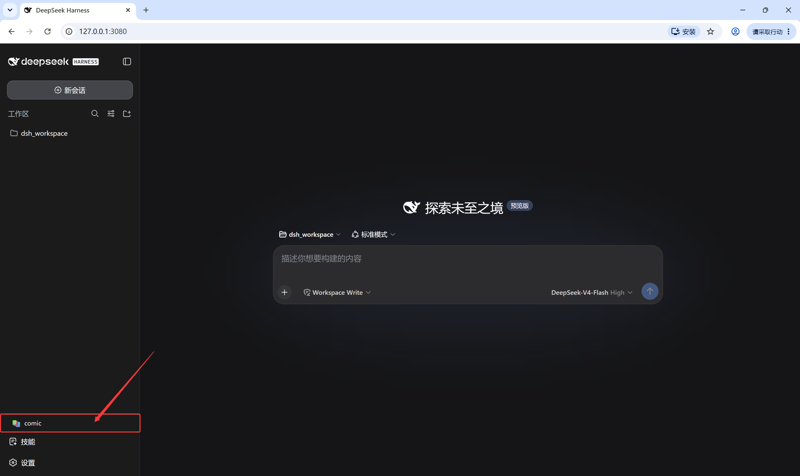
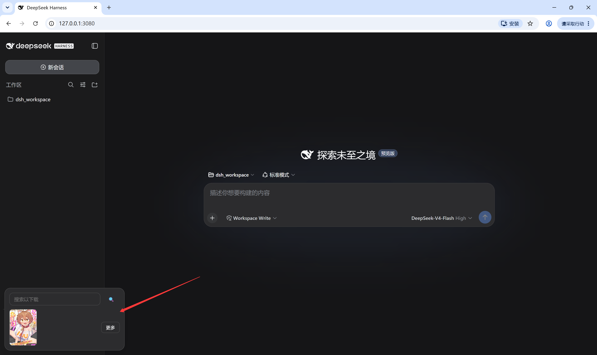
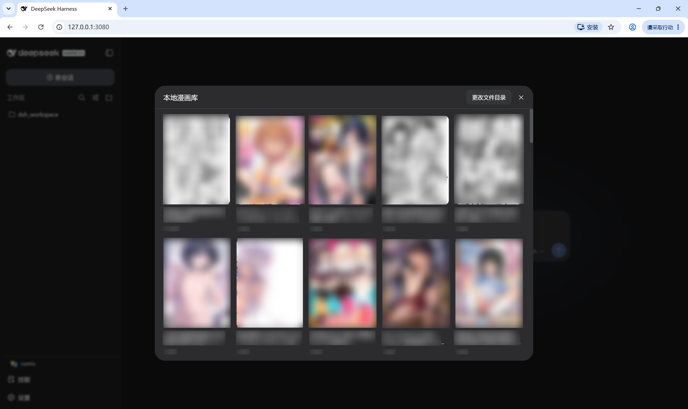

# dsh-jmcomic

简体中文 · [English](./README.md) · [日本語](./README.ja.md)

DeepSeek Harness 插件。在侧栏加一个 comic 按钮,可以搜索下载禁漫(JMComic)的漫画,浏览本地漫画库,在窗口里直接看。

## 功能

- 侧栏 comic 按钮(在技能按钮上方)
- 小窗:输入编号或名称搜索下载;绑定本地文件夹后显示最近看的 2-3 本封面,点封面直接开始读
- 大窗:本地漫画库网格,点进任意一本看章节列表
- 阅读窗口可拖边/角自由调大小,拖顶部把手移动,尺寸位置会自动记住
- 再打开一本漫画时,会跳回上次读到的章节和页数
- 阅读器底部显示当前页/总页数,可直接输入页码跳转
- 悬停漫画卡片出现删除按钮(只允许删库目录下的漫画,删不了根目录和系统目录)
- 下载进行时窗口顶部显示 downloading
- 设置里可改默认文件夹和 Python 路径(设置 → 插件 → 插件配置 → jmcomic)
- 首次打开如果环境不完整,会弹一次提示,附上官方项目链接

## 截图







## 离线运行

插件自带 jmcomic 2.7.3 源码、commonX、jmcomic-ai 包和阅读器前端(vendor 目录),不装 jmcomic 的 pip 包也能用。缺二进制依赖会自动降级:

| 缺失 | 行为 |
|---|---|
| curl_cffi | 改用 requests |
| Pillow | 不解码图片,文件能下不能看 |
| pycryptodome | 提示安装 |

## 安装

```bash
dsh plugin --profile web add github:lywusichen/dsh-jmcomic
```

## 构建

```bash
npm install   # esbuild
npm run build # 生成 lib/client.js 和 lib/server.cjs
```

## 配置

- 设置文件:`~/.dsh/plugins/dsh-jmcomic/settings.json`(Windows)
- 下载用 api 直连,目录规则 `Bd/{Atitle}/第{Pindex}話`,低并发(image 3 / photo 1)

## 声明

下载内核、阅读器前端和部分脚本来自 hect0x7 的项目,已内置在 vendor 目录:

- [JMComic-Crawler-Python](https://github.com/hect0x7/JMComic-Crawler-Python) — 下载内核
- [jm-view-server](https://github.com/hect0x7/jm-view-server) — 阅读器前端
- [jmcomic-ai](https://github.com/hect0x7/jmcomic-ai) — 辅助脚本

版权归原作者所有。
